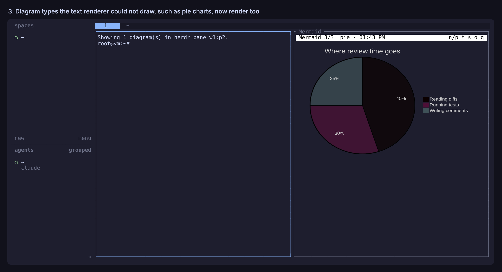

# herdr mermaid

A herdr plugin that renders Mermaid diagrams from your agents in a split next
to the agent, drawn by mermaid.js, the same engine GitHub and Obsidian use.




## How diagrams get to the viewer

1. **Automatically.** When an agent pane goes `done` or `idle`, the plugin reads
   its recent output and looks for Mermaid. It finds fenced ```` ```mermaid ````
   blocks, and also the bare, indented blocks that Claude Code prints after
   dropping the fences. New diagrams open a viewer split to the right of that
   agent, or show up in the viewer that is already open there.
2. **From the agent.** `herdr-mermaid` takes a `.mmd` file, a Markdown file
   (every mermaid block in it), or stdin. Inside a herdr pane it sends the
   diagrams to that pane's viewer. Anywhere else, or with `--print`, it prints
   a box-drawing version. It checks every diagram with mermaid.js first, and a
   diagram that does not parse exits 1 with mermaid's own error, so an agent
   can fix it and try again.
3. **On demand.** The `dotfiles.mermaid.scan` action scans the focused pane,
   reopens the viewer and reports if nothing was found.

## How it draws

The viewer renders each diagram to a PNG with
[mermaid-cli](https://github.com/mermaid-js/mermaid-cli), in a headless Chrome
that stays open while the viewer does, and shows it with the
[Kitty graphics protocol](https://sw.kovidgoyal.net/kitty/graphics-protocol/).
herdr passes those images on to your terminal. That needs a terminal that
speaks the protocol. Ghostty, kitty and WezTerm do; iTerm2 is reported to,
but this plugin has not been tried there yet.

Every diagram type works, including pie, gantt, mindmap and the rest. Images
are cached per pane, so flipping back through history is instant.

Press `t` for a box-drawing text view instead (via
[beautiful-mermaid](https://github.com/lukilabs/beautiful-mermaid)), for
terminals without image support. It covers flowcharts, sequence, class, state
and ER diagrams and xy charts. Set `"display": "text"` to make it the default.

## Viewer keys

| Key | Does |
| --- | --- |
| `n` / `p` | next / previous diagram from this agent (newest is shown first) |
| `t` | switch between the image and the box-drawing text view |
| `h` `j` `k` `l`, arrows, space | text view: scroll a diagram larger than the pane; `g` / `G` top / bottom |
| `a` | text view: plain ASCII (`+-|>`) instead of Unicode box drawing |
| `s` | toggle the Mermaid source |
| `o` | open in the browser |
| `q` | close the viewer |

The viewer also closes itself when its agent pane goes away.

## Setup

`install.sh` does this. By hand:

```sh
npm ci --prefix ~/dotfiles/herdr-plugins/mermaid   # also downloads headless Chrome for puppeteer
ln -s ~/dotfiles/herdr-plugins/mermaid/bin/herdr-mermaid ~/.local/bin/herdr-mermaid
herdr plugin link ~/dotfiles/herdr-plugins/mermaid
```

Optional key binding, in `~/.config/herdr/config.toml`:

```toml
[[keys.command]]
key = "prefix+m"
type = "plugin_action"
command = "dotfiles.mermaid.scan"
description = "render mermaid"
```

To have agents call the CLI themselves, add something like this to
`~/.claude/CLAUDE.md` or `AGENTS.md`:

> When you draw a Mermaid diagram, also pipe its source to `herdr-mermaid` so it
> renders in the terminal. If it exits non-zero, fix the diagram and rerun it.

## Settings

Optional `~/.local/state/herdr-mermaid/config.json`:

```json
{ "auto_open": true, "direction": "right", "scan_lines": 1500,
  "display": "image", "theme": "dark", "background": "transparent" }
```

- `auto_open`: set `false` to get a herdr notification instead of a split.
- `display`: `image` (mermaid.js) or `text` (box drawing).
- `theme`: the mermaid theme for images: `dark`, `default`, `neutral` or `forest`.
- `background`: `transparent` to sit on your terminal's background, or a CSS colour.
- `direction`: `right` or `down`.
- `scan_lines`: how much of the agent's scrollback to search.

Diagram history (the last 50 for each pane) lives next to it in
`~/.local/state/herdr-mermaid/<pane>/`.

## Tests

```sh
npm test
```

The flow tests run the hook and the CLI against `test/fake-herdr.mjs`, so they
need no herdr server. The CLI tests render with real mermaid.js, so they need
the Chrome that `npm ci` downloads (or `PUPPETEER_EXECUTABLE_PATH` pointing at
another Chrome or Chromium).
