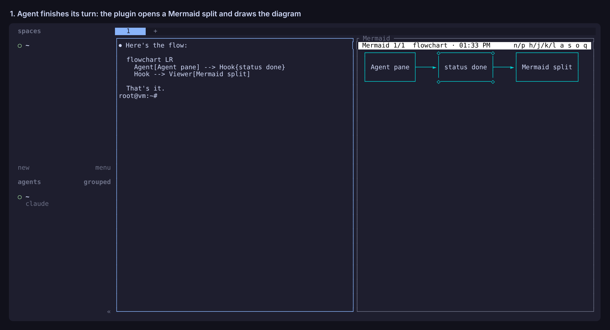

# herdr mermaid

A herdr plugin that renders Mermaid diagrams from your agents as box-drawing
art in a split next to the agent.



```
 Mermaid 2/2  flowchart · 14:02                n/p h/j/k/l a s o q
 ┌────────┐     ┌────────────┐     ┌────────┐
 │        │     │            │     │        │
 │ Agent  ├────►│ herdr hook ├────►│ Viewer │
 │        │     │            │     │        │
 └────────┘     └────────────┘     └────────┘
```

## How diagrams get to the viewer

1. **Automatically.** When an agent pane goes `done` or `idle`, the plugin reads
   its recent output and looks for Mermaid. It finds fenced ```` ```mermaid ````
   blocks, and also the bare, indented blocks that Claude Code prints after
   dropping the fences. New diagrams open a viewer split to the right of that
   agent, or show up in the viewer that is already open there.
2. **From the agent.** `herdr-mermaid` takes a `.mmd` file, a Markdown file
   (every mermaid block in it), or stdin. Inside a herdr pane it sends the
   diagrams to that pane's viewer. Anywhere else, or with `--print`, it prints
   the rendering. A bad diagram header exits 1 with the reason, so an agent can
   fix the diagram and try again.
3. **On demand.** The `dotfiles.mermaid.scan` action scans the focused pane,
   reopens the viewer and reports if nothing was found.

Flowcharts, sequence, class, state and ER diagrams and xy charts render in the
terminal (via [beautiful-mermaid](https://github.com/lukilabs/beautiful-mermaid)).
Other types, such as pie, gantt and mindmap, show their source. Press `o` to
open any diagram in the browser through mermaid.js.

## Viewer keys

| Key | Does |
| --- | --- |
| `n` / `p` | next / previous diagram from this agent (newest is shown first) |
| `h` `j` `k` `l`, arrows, space | scroll a diagram larger than the pane; `g` / `G` top / bottom |
| `a` | toggle plain ASCII (`+-|>`) instead of Unicode box drawing |
| `s` | toggle the Mermaid source |
| `o` | open in the browser |
| `q` | close the viewer |

The viewer also closes itself when its agent pane goes away.

## Setup

`install.sh` does this. By hand:

```sh
npm ci --prefix ~/dotfiles/herdr-plugins/mermaid
ln -s ~/dotfiles/herdr-plugins/mermaid/bin/herdr-mermaid ~/.local/bin/herdr-mermaid
herdr plugin link ~/dotfiles/herdr-plugins/mermaid
```

Optional key binding, in `~/.config/herdr/config.toml`:

```toml
[[keys.command]]
key = "prefix+m"
type = "plugin_action"
command = "dotfiles.mermaid.scan"
description = "render mermaid"
```

To have agents call the CLI themselves, add something like this to
`~/.claude/CLAUDE.md` or `AGENTS.md`:

> When you draw a Mermaid diagram, also pipe its source to `herdr-mermaid` so it
> renders in the terminal. If it exits non-zero, fix the diagram and rerun it.

## Settings

Optional `~/.local/state/herdr-mermaid/config.json`:

```json
{ "auto_open": true, "direction": "right", "scan_lines": 1500 }
```

- `auto_open`: set `false` to get a herdr notification instead of a split.
- `direction`: `right` or `down`.
- `scan_lines`: how much of the agent's scrollback to search.

Diagram history (the last 50 for each pane) lives next to it in
`~/.local/state/herdr-mermaid/<pane>/`.

## Tests

```sh
npm test
```

The flow tests run the hook and the CLI against `test/fake-herdr.mjs`, so they
need no herdr server.
